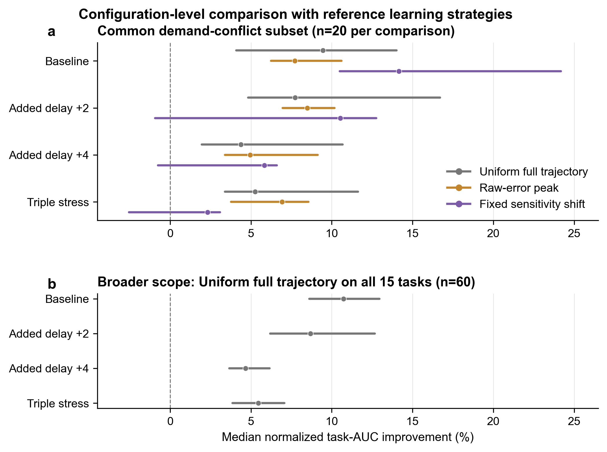
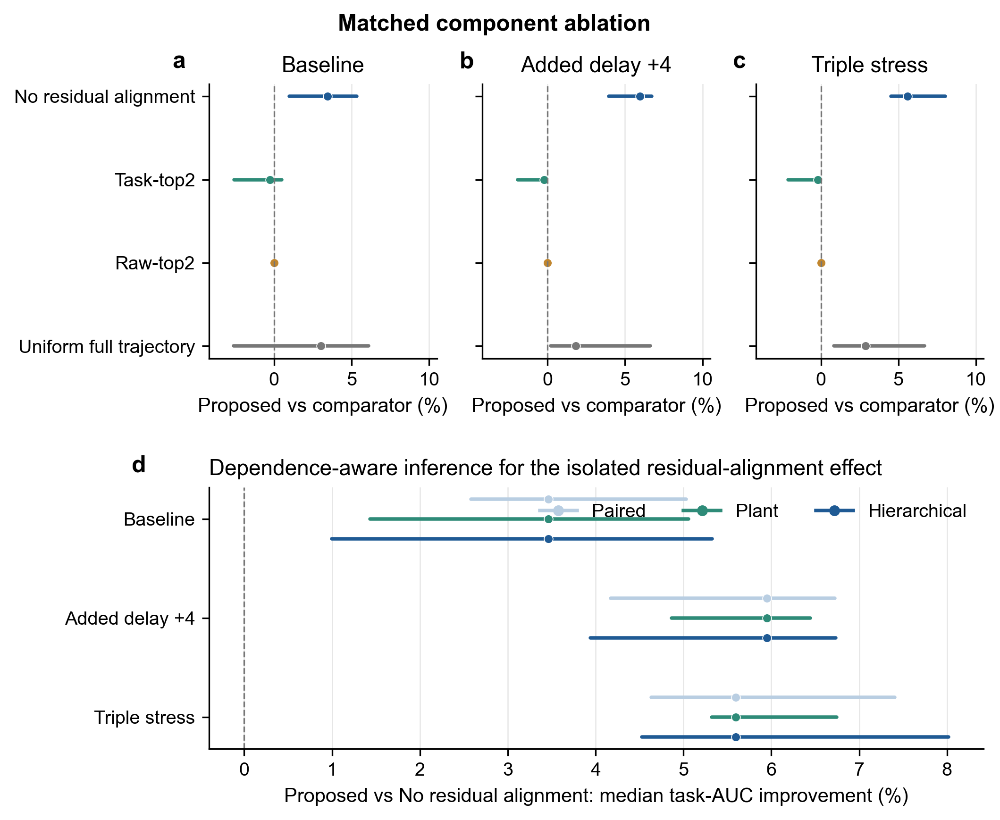
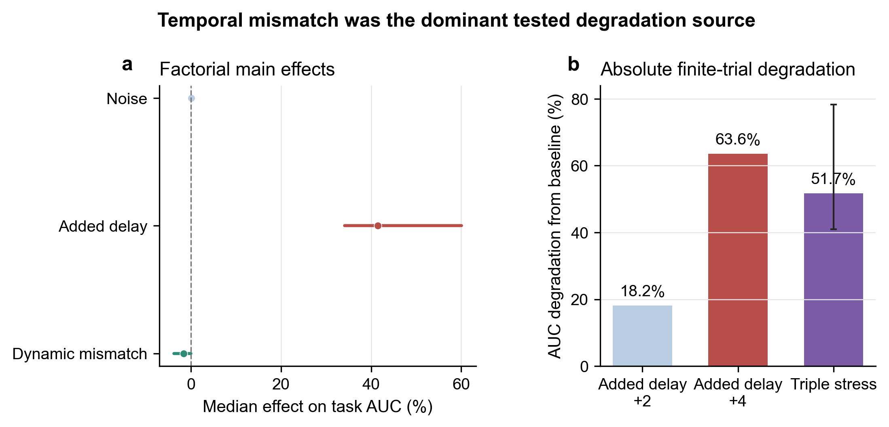
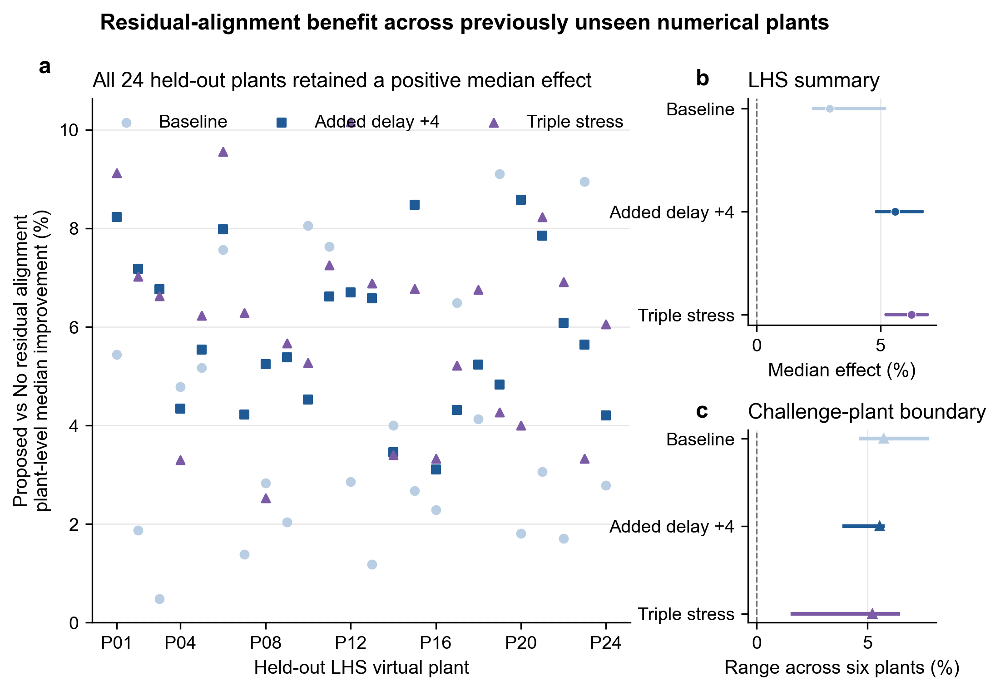
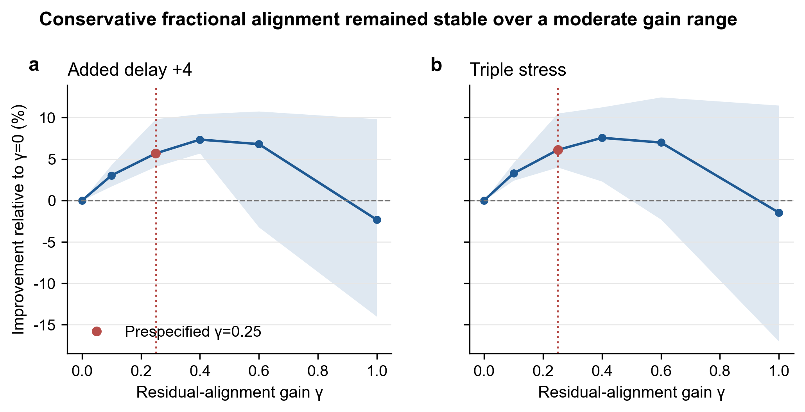
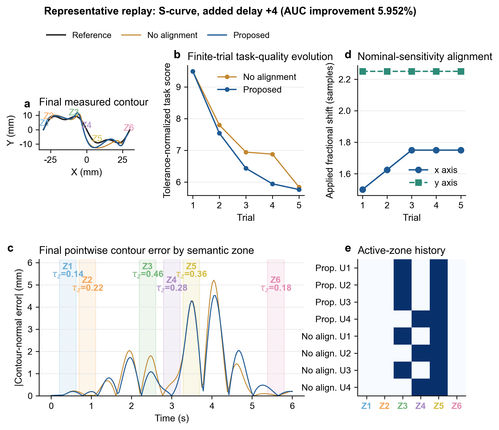

# 5. Experiments and Results

This chapter evaluates the proposed method as a finite-trial command-refinement strategy for repeated virtual CNC contouring. The programmed geometry is fixed, and learning modifies the issued two-axis command within explicit motion and cumulative-correction constraints. Five complete contour executions, including four command updates, test whether program-defined heterogeneous tolerances can guide limited correction authority when the nominal contour sensitivity is temporally mismatched to the hidden feed-drive response. The evaluation addresses five questions. First, how does the complete proposed configuration compare with reference strategies that optimize the complete contour, the largest geometric errors, or a prescribed temporal shift? Second, how does it compare with a literature-grounded constrained basis-function norm-optimal ILC (BF-NOILC) baseline on a prospectively specified plant set? Third, which component accounts for the observed gain under a strictly matched update protocol? Fourth, does the residual-alignment benefit persist across operating conditions and previously unseen numerical plants? Fifth, what computational and command-update trade-offs accompany the observed performance? Configuration-level comparisons and component-level ablations are kept separate so that overall performance and attribution rely on distinct evidence. The chapter quantifies simulated contour tracking and command correction; it does not measure workpiece geometry, surface finish, or cutting performance.

## 5.1 Experimental setup

### 5.1.1 Repeated-contour tasks

The benchmark contains five planar contour families: a harmonic loop, an ellipse, a rounded square, a figure eight, and an S-curve. Each contour is sampled at 161 points over 6 s, giving a sampling interval of 0.0375 s. Six semantic zones are constructed from the programmed trajectory before feedback is observed. Each contour is paired with three tolerance regimes: neutral, demand-aligned, and demand-conflict. The resulting benchmark therefore contains 15 repeated-contour tasks.

The neutral regime assigns a tolerance of 0.24 mm to every zone. The two nonuniform regimes use the same tolerance set, $\{0.14,0.18,0.22,0.28,0.36,0.46\}$ mm, but associate it with the semantic zones in opposite orders. Demand-aligned tasks place tighter tolerances in zones with higher programmed demand, whereas demand-conflict tasks reverse this ordering. The latter group is the primary scope for sparse-selector and residual-alignment comparisons because geometric error magnitude and tolerance-normalized task urgency need not identify the same zones.

All methods start from the same reference and initial command. Each run contains five full trials. The command is updated after the first four trials, while the fifth trial provides the final task-quality observation. The trajectory correction uses cubic B-splines with 12 nominal control points per axis. Endpoint clamping leaves 10 active coefficients per axis and 20 optimization variables in total.

### 5.1.2 Nominal model and hidden numerical plants

The learner uses one fixed nominal model for all experiments. Each nominal axis is represented by a second-order response with natural frequency 16 and damping ratio 0.82. The nominal model contains no explicit transport delay, nonlinear friction, cross-axis coupling, saturation, or repeatable disturbance. These effects are introduced only through the hidden numerical plant.

The hidden plant contains axis-specific second-order dynamics, integer-sample delay, hyperbolic-tangent friction, command saturation, cross-axis coupling, and a repeatable disturbance. Its parameters are unavailable to the learner. Table 1 lists the sampling ranges used in the formal numerical benchmarks.

**Table 1. Hidden numerical-plant parameter ranges.**

| Quantity | Unit | x axis | y axis |
|---|---:|---:|---:|
| Natural frequency | rad s$^{-1}$ | $\mathcal U(15,21)$ | $\mathcal U(10.5,17)$ |
| Damping ratio | – | $\mathcal U(0.60,0.84)$ | $\mathcal U(0.58,0.82)$ |
| Native delay | samples | 1–4 | 2–6 |
| Friction acceleration amplitude | mm s$^{-2}$ | $\mathcal U(1.0,3.6)$ | $\mathcal U(1.5,4.2)$ |
| Velocity scale | mm s$^{-1}$ | $\mathcal U(2.0,4.0)$ | $\mathcal U(1.8,3.8)$ |
| Plant acceleration limit | mm s$^{-2}$ | $\mathcal U(650,900)$ | shared |
| Plant velocity limit | mm s$^{-1}$ | $\mathcal U(80,115)$ | shared |
| Cross-axis coupling | – | $\mathcal U(0.01,0.06)$ | shared |
| Repeatable position-disturbance amplitude | mm | $\mathcal U(0.02,0.075)$ | shared |

The friction amplitude multiplies a dimensionless hyperbolic-tangent term in the acceleration equation, whereas the repeatable disturbance is added directly to the simulated position. The coupling coefficient and damping ratio are dimensionless.

The baseline condition uses the native hidden-plant delay without adding external stress. The added-delay conditions increase the axis delays by two or four samples, corresponding to 75 or 150 ms. Triple stress combines 0.05 mm measurement noise, four additional delay samples, and a 1.70 dynamic-mismatch multiplier. The multiplier scales deviations from the nominal dynamics together with friction, coupling, and repeatable disturbance; it is used as a controlled numerical transformation rather than as a physical machine-severity scale.

### 5.1.3 Experimental blocks and metrics

Table 2 summarizes the experimental blocks. Independent plant sets are used for the original configuration comparison, the prospective literature-baseline comparison, matched ablation, sensitivity study, and held-out plant evaluation. The BF-NOILC comparison used eight new plant seeds that had not been used in the preceding development or formal evaluations. The matched ablation, prospective literature-baseline comparison, and held-out evaluation were executed after the proposed method and its default parameters had been fixed.

**Table 2. Experimental blocks and their evidence roles.**

| Block | Independent plants | Tasks | Conditions | Role |
|---|---:|---:|---:|---|
| Configuration-level benchmark | 4 | 15 | 4 | Comparison with reference learning strategies |
| Prospective literature-baseline benchmark | 8 new plants | 15 | 4 | Configuration-level comparison with constrained BF-NOILC |
| One-factor robustness map | 4 | 15 | 7 | Absolute degradation and robustness boundary |
| Factorial diagnosis | 4 | 15 | $2\times2\times2$ | Main-effect diagnosis |
| Strictly matched ablation | 8 | 15 | 3 | Component attribution |
| Parameter sensitivity | 6 development plants | 5 conflict tasks | 2 | Stability range of the frozen design |
| Held-out LHS family | 24 | 5 conflict tasks | 3 | Plant-level generalization |
| Challenge family | 6 | 5 conflict tasks | 3 | Boundary evaluation |
| Representative replay | 1 automatically selected pair | 1 | Added delay +4 | Trial-wise interpretation |

The primary metric is the finite-trial area under the tolerance-normalized task-quality curve (task AUC). For a proposed method $P$ and comparator $C$, the reported relative effect is

$$
\Delta_{P,C}=100\frac{\operatorname{AUC}_{C}-\operatorname{AUC}_{P}}
{\operatorname{AUC}_{C}}\,\%,
$$

so a positive value favors the proposed method. Because this definition uses the comparator in the denominator, a negative Proposed-versus-comparator effect is reported in its original signed form rather than converted into a reverse percentage. The paired median is used as the center statistic because the effects are heterogeneous across contours and plants.

The prospective BF-NOILC block additionally reports normalized global-RMSE AUC, final task ratio, final worst-zone ratio, runtime, and command-update effort. The terminal ratios compare the fifth-trial value with the shared first-trial value. Cumulative coefficient and learned-command effort are defined as $E_{\theta}=\sum_{k=1}^{4}\|\Delta\theta_k\|_2$ and $E_u=\sum_{k=1}^{4}\|\Delta u_k\|_2$, respectively; issued-command effort, including rollback outcomes, is checked separately. For an effort measure $E$, the BF-NOILC comparison reports $100(E_P-E_{\mathrm{BF}})/E_{\mathrm{BF}}$, so a negative value indicates that Proposed used less update effort. Solver success, finite outputs, implemented-constraint success, rollback behavior, and recorded runtime are reported where relevant.

In the CNC command-refinement interpretation, task AUC measures the finite-trial efficiency with which tolerance-normalized contour quality is reduced and maintained relative to the program-defined task objectives. The final worst-zone ratio describes the relative terminal quality of the least-satisfied semantic zone, whereas global-RMSE AUC describes cumulative whole-contour tracking accuracy. The update-effort measures quantify the cumulative trial-to-trial modification of the learned command trajectory.

## 5.2 Compared methods and evaluation protocol

The comparators are divided into original reference configurations, a literature-grounded configuration-level baseline, and matched ablations. In application terms, they represent distinct command-refinement priorities rather than a simple ordering from weak to strong.

The reference strategies evaluate the complete proposed configuration against alternative ways of allocating and temporally aligning the update:

- **Uniform full trajectory:** distributes correction authority uniformly over the complete programmed contour.
- **Raw-error peak:** directs sparse correction toward the two zones containing the largest geometric contour errors, irrespective of their assigned tolerances.
- **Fixed sensitivity shift:** applies a predetermined four-sample temporal alignment to both axis blocks of the nominal sensitivity.

These comparisons are configuration-level evaluations. The methods differ in more than one algorithmic component; consequently, their performance differences characterize complete learning configurations rather than the isolated contribution of task weighting, selector design, residual alignment, or rollback.

The literature-grounded baseline is **constrained basis-function norm-optimal ILC (BF-NOILC)**, adapted to the command representation and feasibility requirements of this study. It uses the same endpoint-clamped cubic B-spline basis, fixed nominal model, regularization weight $\lambda=3\times10^{-3}$, smoothness weight $\mu=2\times10^{-8}$, and hard cumulative-correction, velocity, acceleration, and coefficient constraints as Proposed. Its norm-optimal objective uses identity weighting over all 161 contour-error samples and therefore represents whole-contour quadratic tracking optimization. The learning rates are $\eta_{\mathrm{BF}}=1$ and $\eta_{\mathrm{Proposed}}=0.65$. BF-NOILC has no task-zone selection or task weighting, residual sensitivity alignment, adaptive trust region, or score-based rollback. Thus, it is a constrained baseline with matched basis, regularization, nominal model, and motion constraints, rather than a parameter-identical comparator or an unmodified reproduction of classical NOILC.

By contrast, Proposed forms its two-zone update set by combining one tolerance-normalized task-urgency anchor with one complementary raw-error anchor, aligns the nominal contour sensitivity with the observed residual response, and limits or rejects command modifications through constrained optimization, adaptive trust control, and rollback. This design targets task-aware, bounded-update finite-trial correction rather than minimum whole-contour quadratic error alone.

The BF-NOILC experiment is a configuration-level literature-baseline comparison on eight prospectively specified new plants. It is distinct from both the original Uniform full-trajectory reference configuration and the matched Uniform full-trajectory ablation: the three evaluations use different protocols and answer different questions. Observed differences between Proposed and BF-NOILC therefore cannot be assigned solely to task weighting, temporal alignment, the learning rate, trust adaptation, or rollback.

The matched ablation changes one design choice while retaining the same sparse-zone budget, balanced active-zone weights, quadratic update, motion constraints, trust region, and rollback logic:

- **No residual alignment:** retains the complete task-aware update but sets the residual-alignment gain to zero.
- **Task-top2:** selects both active zones by tolerance-normalized task urgency.
- **Raw-top2:** selects both active zones by raw contour-error magnitude.
- **Proposed method:** uses the interpretable task/raw complementary selector and residual effective-lag alignment with $\gamma=0.25$.

All methods are paired on the same task, hidden plant, operating condition, and measurement-noise realization within each experimental block. The original configuration benchmark uses 20,000 seeded bootstrap resamples of paired task–plant observations. The prospective BF-NOILC comparison and matched ablation use three complementary intervals. The paired bootstrap resamples individual task–plant pairs. The plant bootstrap resamples complete virtual plants while retaining their tasks. The hierarchical bootstrap first resamples plants and then resamples tasks within each selected plant, always preserving the method pairing. The hierarchical interval is primary for both the BF-NOILC comparison and component-level statements.

## 5.3 Configuration-level comparisons

### 5.3.1 Original reference-configuration benchmark

For direct cross-strategy comparison, the primary view restricts all three reference baselines to the same demand-conflict subset (Fig. 2a and Table 3). Relative to uniform full-trajectory learning on these tasks, the proposed configuration improved median task AUC by 9.461% at baseline, 7.738% with two additional delay samples, 4.379% with four additional samples, and 5.254% under triple stress. The paired intervals were positive in all four conditions, with win rates between 85% and 90%.

Relative to raw-error-peak learning on demand-conflict tasks, the proposed configuration improved median task AUC by 7.715% at baseline, 8.493% with two additional delay samples, 4.948% with four additional samples, and 6.930% under triple stress. The intervals were positive in all four conditions, with paired win rates between 85% and 100%. These results establish the performance of the complete proposed configuration against a sparse geometric-error strategy; they do not assign the difference to any individual internal component.

The fixed sensitivity shift was a stronger temporal baseline. The proposed configuration improved over fixed four-sample alignment by 14.157% at baseline, where the prescribed four-sample shift was not matched to the baseline residual lag. Under the three added-delay conditions, the median differences remained positive but their intervals crossed zero. Thus, the online residual-alignment configuration was statistically comparable to the fixed-shift baseline under added-delay conditions while avoiding the requirement to prescribe the same temporal offset for every operating condition.

The broader full-trajectory comparison retains all 15 tasks as a secondary scope result (Fig. 2b). In this larger task set, the median improvement ranged from 4.669% under four additional delay samples to 10.733% at baseline, with positive paired intervals and win rates from 88.3% to 96.7%. Separating this result from the common-subset panel prevents its larger sample and broader task composition from being interpreted as directly comparable with the demand-conflict-only effect sizes. For finite-trial virtual CNC command refinement, the common-subset results favor the complete Proposed configuration over the Uniform full-trajectory and Raw-error-peak reference configurations; the contribution of individual design elements is examined separately in Section 5.4.

**Figure 2. Configuration-level comparison with reference learning strategies.** Points show paired median improvement in normalized task AUC and lines show 95% bootstrap intervals. Panel a compares Uniform full trajectory, Raw-error peak, and Fixed sensitivity shift on the same demand-conflict subset ($n=20$ per comparison and condition). Panel b retains the broader Proposed-versus-Uniform comparison across all 15 tasks ($n=60$ per condition). The results compare complete configurations and are not used for component-level attribution.

**Table 3. Configuration-level normalized task-AUC improvement of the proposed method.** The primary rows use a common demand-conflict subset; the final four rows report the broader all-task scope. Positive values favor the proposed configuration.

| Scope | Condition | Comparator | n | Median improvement | 95% CI | Win rate |
|---|---|---|---:|---:|---:|---:|
| Demand-conflict | Baseline | Uniform full trajectory | 20 | 9.461% | [4.091%, 14.002%] | 90.0% |
| Demand-conflict | Added delay +2 | Uniform full trajectory | 20 | 7.738% | [4.827%, 16.708%] | 85.0% |
| Demand-conflict | Added delay +4 | Uniform full trajectory | 20 | 4.379% | [1.963%, 10.670%] | 85.0% |
| Demand-conflict | Triple stress | Uniform full trajectory | 20 | 5.254% | [3.392%, 11.625%] | 90.0% |
| Demand-conflict | Baseline | Raw-error peak | 20 | 7.715% | [6.239%, 10.607%] | 95.0% |
| Demand-conflict | Added delay +2 | Raw-error peak | 20 | 8.493% | [6.967%, 10.168%] | 100.0% |
| Demand-conflict | Added delay +4 | Raw-error peak | 20 | 4.948% | [3.384%, 9.134%] | 90.0% |
| Demand-conflict | Triple stress | Raw-error peak | 20 | 6.930% | [3.773%, 8.557%] | 85.0% |
| Demand-conflict | Baseline | Fixed sensitivity shift | 20 | 14.157% | [10.488%, 24.189%] | 80.0% |
| Demand-conflict | Added delay +2 | Fixed sensitivity shift | 20 | 10.528% | [−0.935%, 12.749%] | 65.0% |
| Demand-conflict | Added delay +4 | Fixed sensitivity shift | 20 | 5.829% | [−0.761%, 6.608%] | 65.0% |
| Demand-conflict | Triple stress | Fixed sensitivity shift | 20 | 2.307% | [−2.553%, 3.078%] | 60.0% |
| All 15 tasks | Baseline | Uniform full trajectory | 60 | 10.733% | [8.613%, 12.950%] | 96.7% |
| All 15 tasks | Added delay +2 | Uniform full trajectory | 60 | 8.682% | [6.193%, 12.662%] | 95.0% |
| All 15 tasks | Added delay +4 | Uniform full trajectory | 60 | 4.669% | [3.662%, 6.149%] | 88.3% |
| All 15 tasks | Triple stress | Uniform full trajectory | 60 | 5.448% | [3.853%, 7.065%] | 90.0% |

### 5.3.2 Prospective literature-baseline benchmark

The separate BF-NOILC benchmark paired Proposed and constrained BF-NOILC on eight prospectively specified new plants, all 15 tasks, and the same four operating conditions. Each condition therefore contained 40 demand-conflict task–plant pairs for the primary analysis and 120 pairs for the broader all-task analysis. The comparison used the signed Proposed-versus-BF-NOILC effect defined in Section 5.1; positive values favor Proposed.

On the primary demand-conflict subset, the task-AUC effect was −23.269% at baseline, with a hierarchical 95% interval of [−46.026%, −5.666%] (Table 4). BF-NOILC therefore achieved lower finite-budget task AUC in the baseline condition. The signed effect narrowed to −5.352% with two additional delay samples, −2.215% with four additional samples, and −1.818% under triple stress; all three hierarchical intervals crossed zero. Proposed superiority on task AUC was consequently not established in any of the four conditions, while support for lower BF-NOILC task AUC was confined to baseline in the primary analysis.

Global tracking and terminal task behavior showed different patterns. The global-RMSE-AUC effects were negative with intervals below zero in all four conditions, indicating lower finite-budget global RMSE for BF-NOILC. This outcome is consistent with BF-NOILC's whole-contour quadratic objective, although the configuration-level design does not isolate the objective as the sole cause. By contrast, under four additional delay samples, Proposed had positive final-task and final worst-zone effects of 6.550% [0.270%, 16.695%] and 7.319% [0.919%, 21.824%], respectively. Under triple stress, the final worst-zone effect remained positive at 6.475% [0.334%, 15.134%], whereas the final-task interval crossed zero. Thus, BF-NOILC was stronger on cumulative whole-contour tracking, while Proposed showed a selective terminal advantage in the tolerance-critical task metrics under high delay, not an overall finite-budget advantage.

Across all 15 tasks, the task-AUC effects were −16.035% [−33.538%, −7.785%] at baseline, −5.150% [−11.896%, −3.265%] with two additional delay samples, −3.180% [−5.090%, −1.351%] with four additional samples, and −1.945% [−4.262%, 0.664%] under triple stress. This broader scope preserves the same progressive narrowing of the signed difference, although its intervals remained below zero through the added-delay +4 condition. Because the prospective benchmark differs from the original four-plant protocol and the methods differ in multiple components, these results are not pooled with Table 3 and are not used for component-level attribution. Section 5.9 evaluates the associated runtime and update-effort trade-off.

**Table 4. Prospective configuration-level comparison with constrained BF-NOILC on demand-conflict tasks.** Effects are signed Proposed-versus-BF-NOILC medians with hierarchical-bootstrap 95% intervals; $n=40$ paired task–plant observations per condition. Positive values favor Proposed. Task AUC and global-RMSE AUC summarize all five trials, whereas the terminal ratios describe the fifth trial.

**a. Finite-budget metrics.**

| Condition | Task-AUC effect | Global-RMSE-AUC effect |
|---|---:|---:|
| Baseline | −23.269% [−46.026%, −5.666%] | −42.196% [−60.419%, −27.001%] |
| Added delay +2 | −5.352% [−16.770%, 1.429%] | −18.428% [−35.003%, −9.464%] |
| Added delay +4 | −2.215% [−4.363%, 2.497%] | −9.354% [−13.495%, −2.942%] |
| Triple stress | −1.818% [−4.290%, 1.659%] | −8.095% [−15.582%, −2.312%] |

**b. Terminal fifth-trial metrics.**

| Condition | Final-task effect | Final worst-zone effect |
|---|---:|---:|
| Baseline | −39.570% [−88.620%, 6.486%] | −33.530% [−83.525%, 8.980%] |
| Added delay +2 | 4.664% [−26.148%, 17.987%] | 3.562% [−19.400%, 24.047%] |
| Added delay +4 | 6.550% [0.270%, 16.695%] | 7.319% [0.919%, 21.824%] |
| Triple stress | 5.374% [−1.105%, 14.254%] | 6.475% [0.334%, 15.134%] |

## 5.4 Matched ablation and dependence-aware inference

The strictly matched ablation identified residual effective-lag alignment as the stable independent source of improvement (Fig. 3). Disabling alignment while leaving the selector, weights, constrained update, trust region, and rollback unchanged increased finite-trial task AUC in all three conditions. The proposed method improved over No residual alignment by a median 3.462% at baseline, 5.952% with four additional delay samples, and 5.597% under triple stress. The corresponding hierarchical intervals were [0.996%, 5.325%], [3.939%, 6.734%], and [4.524%, 8.016%]. Pairwise win rates were 90.0%, 82.5%, and 85.0%, respectively.

The selector ablations gave a different result. Relative to Task-top2, the median effects were −0.258%, −0.203%, and −0.183% across the three conditions, and each interval touched or crossed zero. Relative to Raw-top2, the median effect was zero. Exact AUC ties occurred in 15/40 baseline pairs, 22/40 added-delay pairs, and 24/40 triple-stress pairs; every exact tie coincided with identical complete active-zone histories for the two methods. Because the remaining alignment, weighting, optimization, and safety machinery was matched, identical selections produced identical trial trajectories and AUC values. The resulting empirical atom at zero concentrated the bootstrap median at zero. The degenerate or near-degenerate median intervals reflect the high frequency of exact paired ties rather than numerical failure and should not be interpreted as evidence of equivalence or zero uncertainty. The mixed task/raw selector is therefore retained as an interpretable complementary selector: it guarantees coverage of both tolerance-normalized urgency and an independent raw-error peak within the two-zone budget. The matched evaluation did not establish an additional synergistic performance gain from mixing the two ranking signals.

The full-trajectory comparator was also rebuilt inside the common optimization and safety framework. The proposed method improved over this matched comparator by 1.823% with four additional delay samples and by 2.866% under triple stress; the hierarchical intervals were positive. The baseline interval crossed zero. This matched ablation isolates objective coverage under a shared safety wrapper. It is not equivalent to the separately implemented constrained BF-NOILC benchmark, which uses $\eta_{\mathrm{BF}}=1$ and no adaptive trust region or rollback.

**Figure 3. Matched component ablation and dependence-aware inference.** Panels a–c show the proposed method relative to four matched ablations on demand-conflict tasks. Points are paired medians and lines are hierarchical-bootstrap 95% intervals (eight independent plants and 40 task–plant pairs per condition). Panel d compares paired, plant, and hierarchical intervals for Proposed versus No residual alignment.

**Table 5. Strictly matched ablation on demand-conflict tasks.** Intervals are hierarchical-bootstrap 95% intervals; $n=40$ paired task–plant observations per condition. Tie rate is the proportion of exactly equal paired task-AUC values.

| Condition | Comparator | Median improvement | Hierarchical 95% CI | Win rate | Tie rate |
|---|---|---:|---:|---:|---:|
| Baseline | No residual alignment | 3.462% | [0.996%, 5.325%] | 90.0% | 0.0% |
| Baseline | Task-top2 | −0.258% | [−2.593%, 0.508%] | 40.0% | 7.5% |
| Baseline | Raw-top2 | 0.000% | [0.000%, 0.000%] | 32.5% | 37.5% |
| Baseline | Uniform full trajectory | 3.032% | [−2.604%, 6.107%] | 60.0% | 0.0% |
| Added delay +4 | No residual alignment | 5.952% | [3.939%, 6.734%] | 82.5% | 0.0% |
| Added delay +4 | Task-top2 | −0.203% | [−1.913%, 0.000%] | 15.0% | 32.5% |
| Added delay +4 | Raw-top2 | 0.000% | [0.000%, 0.000%] | 27.5% | 55.0% |
| Added delay +4 | Uniform full trajectory | 1.823% | [0.200%, 6.641%] | 72.5% | 0.0% |
| Triple stress | No residual alignment | 5.597% | [4.524%, 8.016%] | 85.0% | 0.0% |
| Triple stress | Task-top2 | −0.183% | [−2.126%, 0.000%] | 15.0% | 27.5% |
| Triple stress | Raw-top2 | 0.000% | [0.000%, 0.045%] | 30.0% | 60.0% |
| Triple stress | Uniform full trajectory | 2.866% | [0.823%, 6.692%] | 72.5% | 0.0% |

The dependence-aware analysis preserved the residual-alignment result under three resampling units. In the added-delay +4 condition, the paired, plant, and hierarchical intervals were [4.170%, 6.725%], [4.866%, 6.446%], and [3.939%, 6.734%], respectively. The leave-one-plant-out median effect varied only from 5.831% to 6.015%, showing that the result was distributed across the eight independent plants rather than determined by one domain.

The 5.952% matched estimate and the 4.616% estimate from the broader formal benchmark have distinct roles. The former uses eight new plants, 40 demand-conflict pairs, identical internal update machinery, and hierarchical resampling; it is the primary estimate for component attribution. The latter was obtained from four independent plants and 20 demand-conflict pairs in a broader five-strategy benchmark, with a 95% interval of [1.844%, 8.190%]. Its consistent direction provides cross-protocol support for the residual-alignment effect. In contour-command terms, the matched result shows that residual alignment improves the temporal consistency between the nominal contour-sensitivity map and the observed residual-error response.

## 5.5 Temporal-mismatch diagnosis

The relevant failure mode can be stated directly in the command-trajectory domain. The nominal sensitivity predicts that a B-spline coefficient correction will influence the measured contour near sample $i$. Feed-drive temporal mismatch displaces that effective influence along the sampled trajectory, so the nominal contour-sensitivity map and the observed residual-error response no longer refer to the same location. The resulting error is particularly consequential near semantic-zone boundaries, where a displaced correction can act outside the tolerance-critical region that motivated the update. Residual effective-lag alignment is designed to reduce this mapping inconsistency; it is not an identification of a unique physical transport delay.

The uncompensated task-aware learner was most sensitive to temporal mismatch. In the one-factor experiment, adding two delay samples increased its median task AUC by 18.176% relative to its own baseline; four additional samples increased it by 63.567%. By comparison, the tested noise and dynamic-mismatch perturbations caused much smaller changes in absolute AUC.

The factorial experiment isolated the same pattern. Changing the additional-delay factor from zero to four samples produced a median 41.441% degradation in task AUC, with a 95% interval of [34.089%, 60.074%]. The noise main effect was 0.064% [−0.066%, 0.224%]. The dynamic-mismatch effect was −1.676% [−3.861%, −0.012%] in this two-level transformation, indicating that the numerical mismatch multiplier was not a monotone difficulty axis. Under the combined triple-stress condition, the uncompensated learner's AUC was 51.728% higher than at baseline [41.023%, 78.283%].

A parallel delay-dependent pattern appeared in the separate eight-plant BF-NOILC comparison. The signed Proposed-versus-BF-NOILC task-AUC effect changed from −23.269% at baseline to −2.215% with four additional delay samples and −1.818% under triple stress. This configuration-level narrowing is consistent with a change in the relative behavior of the two complete methods under temporal mismatch, but it does not isolate residual alignment or any other component as its sole cause. The factorial and matched experiments remain the direct evidence for the diagnosis and the alignment contribution, respectively.

**Figure 4. Temporal-mismatch diagnosis.** Panel a shows factorial main effects on the uncompensated task-aware learner; points are median effects and lines are 95% bootstrap intervals. Panel b reports absolute finite-trial AUC degradation relative to the corresponding baseline. The triple-stress bar includes its 95% interval. Additional delay was the dominant tested source of misalignment between the predicted and effective contour-correction locations and provided a direct target for sensitivity alignment.

## 5.6 Generalization across held-out virtual plants

The benefit of residual effective-lag alignment generalized across 24 previously unseen LHS virtual plants (Fig. 5). This experiment compares the Proposed method directly with No residual alignment; all remaining selector, weighting, constraint, trust-region, and rollback settings are identical. Each plant was evaluated on the five demand-conflict tasks under baseline, added-delay +4, and triple-stress conditions, making the virtual plant the primary statistical unit.

The plant-level median improvement was 2.960% at baseline, 5.589% with four additional delay samples, and 6.258% under triple stress. The plant-level bootstrap intervals were [2.291%, 5.173%], [4.832%, 6.697%], and [5.218%, 6.889%], respectively. All 24 plants had a positive median residual-alignment effect in each condition. The minimum plant-level median effect remained positive within the predefined LHS family: 0.484% at baseline, 3.106% with added delay, and 2.523% under triple stress.

**Figure 5. Residual-alignment benefit across previously unseen numerical plants.** Every effect is Proposed versus No residual alignment. Panel a shows the median effect for each of 24 held-out LHS plants. Panel b summarizes the plant-level median and 95% bootstrap interval. Panel c shows the range across six separately defined challenge plants; these plants are used for boundary evaluation and are not included in the LHS confidence intervals.

**Table 6. Proposed versus No residual alignment across 24 held-out LHS virtual plants.**

| Condition | Plant-level median improvement | 95% CI | Plant win rate | Minimum plant effect |
|---|---:|---:|---:|---:|
| Baseline | 2.960% | [2.291%, 5.173%] | 100% | 0.484% |
| Added delay +4 | 5.589% | [4.832%, 6.697%] | 100% | 3.106% |
| Triple stress | 6.258% | [5.218%, 6.889%] | 100% | 2.523% |

The six challenge plants separately emphasized maximum delay, low bandwidth, strong axis asymmetry, strong coupling, strong friction, and tight saturation. Their plant-level effects remained positive in the tested conditions, with ranges of [4.709%, 7.703%] at baseline, [3.951%, 5.700%] with four additional delay samples, and [1.628%, 6.398%] under triple stress. The LHS family represents a predefined numerical uncertainty set rather than an empirical population of physical machines. Within that scope, the alignment benefit was not confined to one nominal feed-drive realization.

## 5.7 Sensitivity to the residual-alignment gain

The residual-alignment gain $\gamma$ controlled a clear stability–aggressiveness trade-off (Fig. 6). Relative to $\gamma=0$, gains of 0.10, 0.25, and 0.40 produced positive intervals in both the added-delay +4 and triple-stress conditions. At $\gamma=0.60$, the median effect remained positive but the intervals crossed zero. Full compensation, $\gamma=1$, reduced median performance by 2.338% under added delay and by 1.470% under triple stress, with wide intervals in both conditions. These observations favor fractional sensitivity alignment over direct application of the complete estimated residual lag.

**Figure 6. Sensitivity to the residual-alignment gain.** Points show median task-AUC improvement relative to $\gamma=0$, and shaded regions show paired-bootstrap 95% intervals on six independent development plants. The vertical line marks the prespecified value $\gamma=0.25$ used in the confirmatory evaluations.

The prespecified value $\gamma=0.25$ lies within the stable region and was retained unchanged. The one-factor development scan did not alter the confirmatory configuration. The accompanying parameter checks were less influential. Smoothing windows of 3, 5, 7, and 9 produced effectively identical results in the current implementation. Reducing the nominal spline control points from 12 to 8 degraded performance, whereas increasing them to 16 did not yield a stable improvement. A learning rate of $\eta=0.50$ was approximately 10% worse than the frozen value of $\eta=0.65$. A rate of $\eta=0.80$ produced development-set gains of 6.809% under added delay and 4.979% under triple stress, but the formal experiments retained the prespecified rate of $\eta=0.65$. The gain study therefore supports fractional, conservative sensitivity alignment: a partial lag correction improves the effective contour mapping, whereas full compensation risks over-correcting an uncertain residual-lag estimate.

## 5.8 Representative trial-wise behavior

The representative replay was selected automatically from the added-delay +4 demand-conflict pairs by choosing the pair whose improvement was closest to the matched-ablation median. This rule selected the S-curve task on plant S24004. The paired improvement was 5.952%, compared with a candidate-set median of 5.952%.

Both methods started from the same tolerance-normalized task score of 9.490. After five trials, the proposed method reached 5.764, whereas No residual alignment reached 5.842. The proposed method obtained a normalized task AUC of 0.72555, compared with 0.77147 for the matched ablation. The largest separation occurred during the middle trials, where the aligned nominal sensitivity produced a faster reduction in task score.

The measured total axis lags stabilized at approximately nine samples on the x axis and eleven samples on the y axis, while the nominal model contributed two samples on each axis under the diagnostic definition. After nominal-lag subtraction, cumulative-median aggregation, and $\gamma=0.25$ shrinkage, the applied fractional shifts converged to 1.75 samples on x and 2.25 samples on y. Temporal alignment was applied to the nominal sensitivity model; no explicit temporal shift was applied to the reference or command signal. The command was updated through constrained optimization rather than translated as a complete time series.

For the machining-oriented interpretation, the task-score, pointwise-error, and active-zone panels should be read together. The task-score history describes finite-trial progress toward the program-defined tolerance objectives; the pointwise contour-normal error shows where residual geometric deviation remains relative to the programmed semantic zones; and the active-zone history shows where the limited command-update budget is allocated. In panel c, each shaded interval is labeled by its program-defined zone-level normalization scale $\tau_z$. The shading locates the zone and does not define a pointwise acceptance envelope.

**Figure 7. Representative median-effect replay.** Panel a compares the final measured contours. Panel b shows finite-trial progress toward the program-defined tolerance objectives. Panel c reports the final pointwise contour-normal error and overlays the six semantic-zone intervals, with labels giving the corresponding zone-level normalization scale $\tau_z$ in millimetres; the shaded intervals are not pointwise tolerance limits. Panel d shows the axis-specific fractional shifts applied to the nominal sensitivity model. Panel e records the active semantic zones selected during the four updates. The same zone colors are used in panels a, c, and e. Panels b, c, and e jointly relate task evolution, residual contour error, and allocation of correction authority. The replay is explanatory; the aggregate comparisons in Sections 5.3–5.6 provide the statistical evidence.

## 5.9 Computational behavior, numerical feasibility, and update effort

The proposed method preserved numerical and implemented-command feasibility across the evaluated conditions. The formal configuration benchmark recorded 100% solver success and 100% final constraint success for all five evaluated strategies. The matched ablation, sensitivity study, and held-out plant evaluation also completed with finite outputs and full implemented-constraint success.

Update effort is a primary practical outcome because it measures how strongly learning alters the programmed command trajectory. Proposed used less effort than BF-NOILC on the demand-conflict subset (Table 7). Its cumulative learned-command effort difference ranged from −19.161% at baseline to −28.730% with four additional delay samples. The cumulative coefficient-effort difference ranged from −22.912% to −30.639%, and every hierarchical interval remained below zero. The issued-command effort, which accounts for rollback outcomes, gave the same directional conclusion.

The effort and terminal metrics together define the principal command-refinement trade-off. Under four additional delay samples, Proposed combined 28.730% lower cumulative learned-command effort with positive final-task and final worst-zone effects. Under triple stress, it combined 27.952% lower learned-command effort with a positive final worst-zone effect, while the final-task interval crossed zero. The selective terminal advantage under strong mismatch was therefore not purchased through larger command corrections. This result supports a bounded application claim: smaller command-trajectory modification can coexist with better terminal quality in particular tolerance-critical metrics under high delay, but not with uniformly better cumulative or global tracking.

**Table 7. Update-effort comparison with constrained BF-NOILC on demand-conflict tasks.** Effects are $100(E_P-E_{\mathrm{BF}})/E_{\mathrm{BF}}$ with hierarchical-bootstrap 95% intervals; $n=40$ paired task–plant observations per condition. Negative values indicate lower Proposed effort.

| Condition | Cumulative $\|\Delta\theta\|_2$ effect | Cumulative learned $\|\Delta u\|_2$ effect |
|---|---:|---:|
| Baseline | −22.912% [−25.893%, −16.233%] | −19.161% [−22.980%, −14.618%] |
| Added delay +2 | −28.725% [−31.273%, −22.347%] | −24.868% [−31.902%, −19.048%] |
| Added delay +4 | −30.639% [−41.499%, −25.368%] | −28.730% [−32.002%, −24.139%] |
| Triple stress | −30.574% [−40.739%, −27.058%] | −27.952% [−32.625%, −22.384%] |

The recorded median runtime was 0.318 s for uniform full-trajectory learning, 0.266 s for raw-error-peak learning, 0.295 s for No residual alignment, 0.346 s for fixed sensitivity shift, and 0.335 s for the proposed method. Residual alignment therefore increased median runtime by approximately 13.3% relative to the matched uncompensated configuration in the recorded software environment. The additional operations consist primarily of axis-wise correlation, cumulative-median aggregation, and fractional interpolation of the nominal sensitivity.

Within the separate prospective literature-baseline benchmark, the median runtime was 0.417 s for Proposed and 0.386 s for constrained BF-NOILC across 480 runs per method. Proposed was therefore approximately 8.0% slower in that recorded environment. These values are reported within their own experimental block and are not pooled with the runtimes from the original four-plant benchmark.

Rollback remained an active part of the finite-trial implementation. For the proposed method, the proportions of runs with at least one rollback were 10.0%, 30.0%, 31.7%, and 25.0% from baseline through triple stress. The corresponding values for No residual alignment were 8.3%, 28.3%, 46.7%, and 46.7%. Alignment therefore reduced observed rollback incidence in the two highest-delay conditions while preserving the same acceptance rule.

Taken together, the experiments establish four bounded results for finite-trial correction of repeated virtual CNC contour commands. Proposed outperformed the original reference configurations based on uniform whole-contour and raw-error-driven learning. In the separate prospective comparison, constrained BF-NOILC achieved lower finite-budget task AUC at baseline and lower global-RMSE AUC throughout, whereas Proposed used smaller command updates and showed selective terminal tolerance-critical advantages under severe temporal mismatch. The strictly matched ablation identified residual effective-lag alignment as the stable independent source of improvement; the complementary task/raw selector remained an interpretable allocation rule rather than an independently confirmed synergy. Finally, the alignment benefit persisted under dependence-aware inference and across 24 previously unseen numerical plants. The evidence supports task-aware, bounded-update contour-command refinement under heterogeneous programmed tolerances and feed-drive temporal mismatch, while also revealing a trade-off among cumulative whole-contour tracking, command-update effort, and terminal critical-zone behavior. It does not establish gains in physical cutting, surface integrity, or workpiece metrology.
